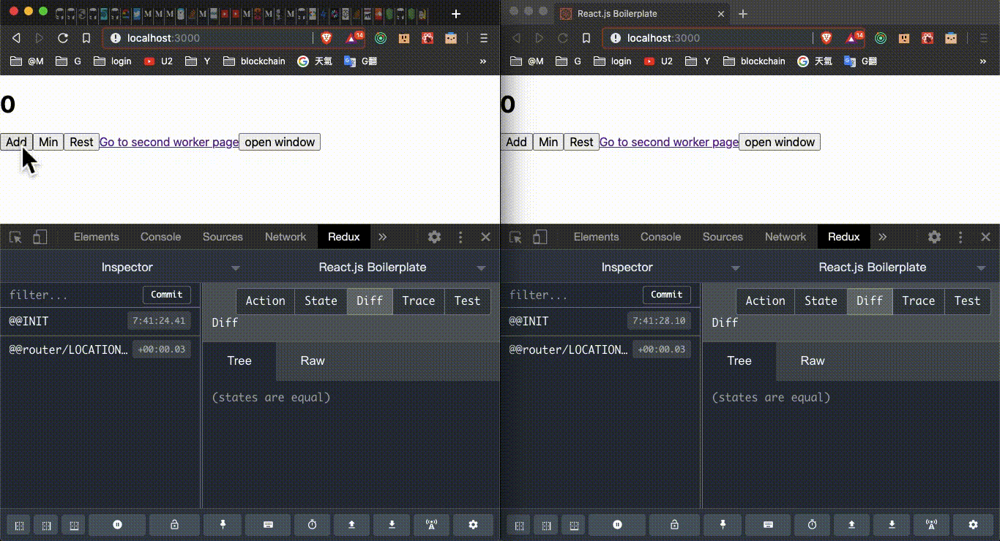
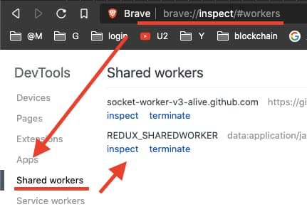
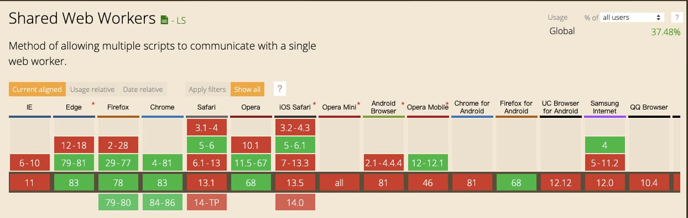

# Redux SharedWorker
SharedWorker [middleware](https://redux.js.org/advanced/middleware) for Redux.

```bash
npm install redux-sharedworker
```

## What Redux SharedWorker can do ?
Relay on [SharedWorker](https://developer.mozilla.org/en-US/docs/Web/API/SharedWorker). We can communicate with multi windows. **Redux SharedWorker** middleware help us to sync **Actions** across multi windows.

<p align="center">
  

## Installation
```bash
npm install redux-sharedworker
```

after intalled, We have to:  
1. Add redux middleware
2. Broadcast Actions
    - And there are **TWO** way to **broadcast Actions**
      1. add action's **type** into **targetActions** (example in below)
      2. add **SHARE_WORDER_SYNC_ACTION** feild in action (example in below)

## Add redux middleware
To enable **Redux SharedWorker**, use [`applyMiddleware()`](https://redux.js.org/api/applymiddleware):

```js
import { createStore, applyMiddleware, compose } from 'redux';
import createSharedWorkerMiddleware from 'redux-sharedworker';
import rootReducer from './reducers/index';

const middlewares = [
  createSharedWorkerMiddleware(),
  //...
];

const enhancers = [applyMiddleware(...middlewares)];

const store = createStore(
  rootReducer,
  compose(...enhancers),
);
```

## createSharedWorkerMiddleware({ customWorker, targetActions })
### customWorker (String)(optional)
`customWorker` allow you customize `worker.js`
```js
// this is default `customWorker`.
const ports = [];
onconnect = function (connectEvent) {
  ports.push(connectEvent.ports[0]); // store all port
  connectEvent.ports[0].onmessage = function(event) {
    ports.forEach(port => {
      port.postMessage(event.data); // broadcast Actions to all ports
    })
  }
}
```

#### Example to how **Customize** `worker.js`:
```js
const customWorker = `
  const ports = [];
  onconnect = function (connectEvent) {
    ports.push(connectEvent.ports[0])
    connectEvent.ports[0].onmessage = function(event) {
      ports.forEach(port => {
        port.postMessage(event.data)
      })
    }
  }
`;

const middlewares = [
  createSharedWorkerMiddleware({ customWorker }),
  //...
];
```

### targetActions (Array[String])(optional)(default = [])
`redux-sharedworker` will **broadcast Actions** when action **type** match one of **targetActions**

```js
const middlewares = [
  createSharedWorkerMiddleware({ targetActions: ['ADD'] }),
];
```

<p align="center">
  

## SHARE_WORDER_SYNC_ACTION
Type **SHARE_WORDER_SYNC_ACTION** is an alternative way to **broadcast Actions** when **Action type** does NOT include in **targetActions**.

**Add SHARE_WORDER_SYNC_ACTION** field and set it is **true**. `redux-sharedworker` will **broadcast** this action too.

```js
function mapDispatchToProps(dispatch) {
  return {
    onAdd: () => dispatch({ type: 'ADD' }),
    onMIN: () => dispatch({ type: 'MIN' }),
    onRest: () => dispatch({ type: 'RESET', SHARE_WORDER_SYNC_ACTION: true }),
  };
}

const withConnect = connect(mapStateToProps, mapDispatchToProps);
```

## debug worker
### Chrome
type `chrome://inspect` into URL and `inspect` worker. This can help a lot when you are developing worker. `console.log` information to take look.  

<p align="center">
  

### Firefox
[How to show the active service workers in the firefox dev tools?](https://stackoverflow.com/questions/48428725/how-to-show-the-active-service-workers-in-the-firefox-dev-tools)

## Can I Use ? (browsers support)
- https://caniuse.com/#search=shared 

<p align="center">
  

## TODO
- react hooks example
- DEMO gifs
- DEMO project

## License

MIT